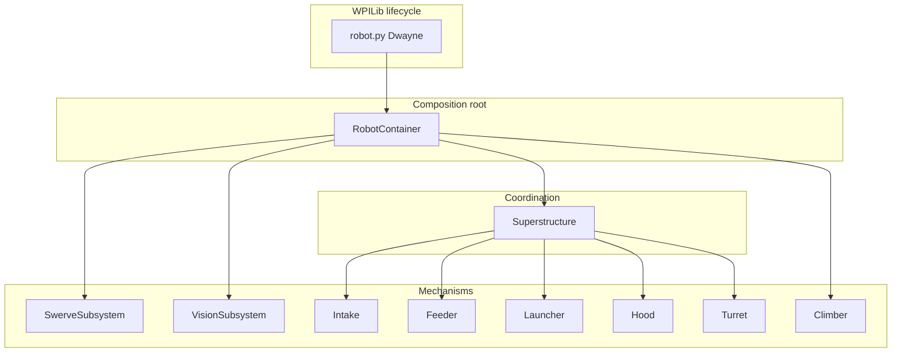

# Architecture overview

## Layered design

**`robot.py`** owns process-level concerns: logging configuration, match/phase NetworkTables for Elastic, cancelling auto when teleop starts, and throttling vision while disabled.

**`robot_container.py`** is the dependency-injection root: it chooses **which concrete IO** each subsystem gets, registers **PathPlanner** commands, and attaches **Triggers** from Xbox controllers.

**`Superstructure`** sits above the scoring stack. Driver and operator inputs generally do **not** set feeder/launcher states directly when a coordinated goal exists; they request a **Goal** so intake/feeder/shooter/hood/turret stay consistent.

## Why IO classes exist

Mechanism folders follow a pattern:

- **Subsystem** — exposes states, commands, and subsystem requirements.
- **IO** — reads sensors and writes motor controllers (or sim models).

Benefits:

- **Simulation** without hardware.
- **Log replay** with stub IO.
- **Clear boundary** for unit tests or future hardware revisions.

## Drivetrain is special

`SwerveSubsystem` extends Phoenix 6’s generated `SwerveDrivetrain` and also implements `commands2.Subsystem`. It handles odometry, module requests, PathPlanner holonomic helpers, and vision measurement injection. Treat it as the **pose authority** for the rest of the robot.

## Configuration cross-cutting

- **`constants.py`** — Field layout (`AprilTagField`), numeric tuning, CAN IDs, transforms.
- **`robot_config.py`** — Which robot is running and **`has_subsystem()`** for partial practice bots.

Together they prevent “Larry” from opening CAN devices that are not wired on the practice chassis.

## Further reading

- [command-scheduler-and-subsystems.md](command-scheduler-and-subsystems.md)
- [../core/robot-container.md](../core/robot-container.md)
- [../subsystems/superstructure.md](../subsystems/superstructure.md)
